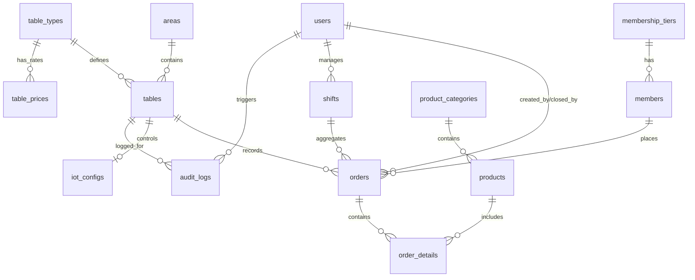

# CẤU TRÚC CƠ SỞ DỮ LIỆU HỆ THỐNG QUẢN LÝ CLB BILLIARDS (BIDA)

Tài liệu này đặc tả cấu trúc Cơ sở dữ liệu (Database Schema) cho hệ thống quản lý CLB Bida, đáp ứng đầy đủ nghiệp vụ cho cả 3 phân hệ: **Desktop Client (Thu ngân & IoT)**, **POS Mobile (Nhân viên)**, và **Manager Mobile (Chủ CLB)**.

Hệ thống sử dụng cơ sở dữ liệu quan hệ (ví dụ: PostgreSQL hoặc MySQL) làm Backend tập trung, kết hợp đồng bộ hóa Real-time qua WebSocket và cơ sở dữ liệu cục bộ (SQLite/Isar) trên Desktop để đảm bảo hoạt động ngoại tuyến khi mất mạng.

---

## 1. SƠ ĐỒ QUAN HỆ THỰC THỂ (ERD DIAGRAM)



---

## 2. CHI TIẾT CÁC BẢNG TRONG CƠ SỞ DỮ LIỆU (DATABASE TABLES)

### 2.1. Nhóm 1: Người dùng & Phân quyền (Users & Authentication)

#### Bảng `users` (Nhân sự)
Lưu trữ thông tin nhân viên, quản lý và chủ CLB để đăng nhập và phân quyền.

| Tên trường | Kiểu dữ liệu | Ràng buộc | Mô tả |
| :--- | :--- | :--- | :--- |
| `id` | `UUID` | PRIMARY KEY, Default gen_random_uuid() | ID duy nhất của người dùng |
| `username` | `VARCHAR(50)` | UNIQUE, NOT NULL | Tên tài khoản đăng nhập |
| `password_hash` | `VARCHAR(255)` | NOT NULL | Mật khẩu đã được mã hóa |
| `display_name` | `VARCHAR(100)` | NOT NULL | Tên hiển thị (Ví dụ: Nguyễn Văn A) |
| `role` | `VARCHAR(20)` | NOT NULL | Vai trò: `admin`, `manager`, `cashier`, `waiter` |
| `phone_number` | `VARCHAR(15)` | Nullable | Số điện thoại liên hệ |
| `is_active` | `BOOLEAN` | Default `TRUE` | Trạng thái hoạt động của tài khoản |
| `created_at` | `TIMESTAMP` | Default NOW() | Thời gian tạo tài khoản |
| `updated_at` | `TIMESTAMP` | Default NOW() | Thời gian cập nhật gần nhất |

---

### 2.2. Nhóm 2: Khách hàng & Thành viên (Members & Loyalty)

#### Bảng `membership_tiers` (Hạng thành viên)
Quy định các hạng thành viên khác nhau để tự động áp dụng ưu đãi chiết khấu khi thanh toán.

| Tên trường | Kiểu dữ liệu | Ràng buộc | Mô tả |
| :--- | :--- | :--- | :--- |
| `id` | `SERIAL` | PRIMARY KEY | ID tự tăng |
| `tier_name` | `VARCHAR(50)` | UNIQUE, NOT NULL | Tên hạng: `Silver`, `Gold`, `Diamond`... |
| `min_points` | `INT` | Default 0 | Số điểm tối thiểu để đạt hạng này |
| `discount_percentage` | `DECIMAL(5,2)` | Default 0.00 | Phần trăm giảm giá mặc định cho hóa đơn (ví dụ: `5.00` tương đương 5%) |
| `created_at` | `TIMESTAMP` | Default NOW() | Thời gian tạo cấu hình hạng |

#### Bảng `members` (Khách hàng)
Thông tin khách hàng đăng ký thành viên tại CLB để tích điểm và hưởng ưu đãi.

| Tên trường | Kiểu dữ liệu | Ràng buộc | Mô tả |
| :--- | :--- | :--- | :--- |
| `id` | `UUID` | PRIMARY KEY, Default gen_random_uuid() | ID duy nhất của khách hàng |
| `full_name` | `VARCHAR(100)` | NOT NULL | Họ và tên khách hàng |
| `phone_number` | `VARCHAR(15)` | UNIQUE, NOT NULL | Số điện thoại (dùng làm mã tra cứu nhanh) |
| `email` | `VARCHAR(100)` | Nullable | Địa chỉ email |
| `membership_tier_id` | `INT` | FOREIGN KEY -> `membership_tiers(id)` | Liên kết hạng thành viên |
| `total_points` | `INT` | Default 0 | Điểm tích lũy hiện tại |
| `accumulated_spend` | `DECIMAL(12,2)`| Default 0.00 | Tổng số tiền đã chi tiêu tại quán (để xét nâng hạng) |
| `created_at` | `TIMESTAMP` | Default NOW() | Ngày tham gia hệ thống |
| `updated_at` | `TIMESTAMP` | Default NOW() | Ngày cập nhật thông tin |

---

### 2.3. Nhóm 3: Sơ đồ bàn & Giá giờ chơi (Billiard Tables & Rates)

#### Bảng `areas` (Khu vực)
Phân chia CLB thành các khu vực để dễ bố trí giao diện lưới bàn.

| Tên trường | Kiểu dữ liệu | Ràng buộc | Mô tả |
| :--- | :--- | :--- | :--- |
| `id` | `SERIAL` | PRIMARY KEY | ID tự tăng |
| `area_name` | `VARCHAR(50)` | NOT NULL | Tên khu vực: `Tầng trệt`, `Phòng VIP 1`, `Khu hút thuốc`... |
| `description` | `TEXT` | Nullable | Mô tả thêm |
| `created_at` | `TIMESTAMP` | Default NOW() | Thời gian tạo |

#### Bảng `table_types` (Loại bàn)
Mỗi loại bàn bida có cách vận hành và mức giá giờ chơi cơ bản khác nhau.

| Tên trường | Kiểu dữ liệu | Ràng buộc | Mô tả |
| :--- | :--- | :--- | :--- |
| `id` | `SERIAL` | PRIMARY KEY | ID tự tăng |
| `type_name` | `VARCHAR(50)` | NOT NULL | Tên loại bàn: `Pool` (Bàn lỗ), `Carom` (Bàn phăng/3 băng), `Snooker` |
| `description` | `TEXT` | Nullable | Mô tả chi tiết |
| `created_at` | `TIMESTAMP` | Default NOW() | Thời gian tạo |

#### Bảng `tables` (Danh sách Bàn)
Quản lý trạng thái hiện tại của từng bàn bida thực tế trong CLB.

| Tên trường | Kiểu dữ liệu | Ràng buộc | Mô tả |
| :--- | :--- | :--- | :--- |
| `id` | `UUID` | PRIMARY KEY, Default gen_random_uuid() | ID duy nhất của bàn |
| `table_name` | `VARCHAR(50)` | NOT NULL | Số/Tên bàn (Ví dụ: `Bàn 01`, `Bàn VIP 02`) |
| `area_id` | `INT` | FOREIGN KEY -> `areas(id)` | Bàn thuộc khu vực nào |
| `table_type_id` | `INT` | FOREIGN KEY -> `table_types(id)` | Kiểu bàn |
| `status` | `VARCHAR(20)` | Default `'idle'` | Trạng thái: `idle` (trống), `active` (có khách), `booked` (đặt trước), `maintenance` (bảo trì) |
| `current_order_id` | `UUID` | Nullable, FOREIGN KEY -> `orders(id)` | ID hóa đơn hiện tại đang mở trên bàn này (dùng để truy vấn nhanh) |
| `created_at` | `TIMESTAMP` | Default NOW() | Ngày tạo bàn |
| `updated_at` | `TIMESTAMP` | Default NOW() | Ngày cập nhật |

#### Bảng `table_prices` (Cấu hình Giá giờ chơi theo khung giờ)
Bảng giá linh động hỗ trợ tăng giá giờ chơi vào buổi tối, cuối tuần hoặc ngày lễ.

| Tên trường | Kiểu dữ liệu | Ràng buộc | Mô tả |
| :--- | :--- | :--- | :--- |
| `id` | `SERIAL` | PRIMARY KEY | ID tự tăng |
| `table_type_id` | `INT` | FOREIGN KEY -> `table_types(id)` | Áp dụng cho loại bàn nào |
| `price_per_hour` | `DECIMAL(10,2)`| NOT NULL | Đơn giá chơi trên 1 giờ (Ví dụ: `80000.00`đ/giờ) |
| `start_hour` | `TIME` | Default '00:00:00' | Giờ bắt đầu áp dụng khung giá này (Ví dụ: `18:00:00`) |
| `end_hour` | `TIME` | Default '23:59:59' | Giờ kết thúc áp dụng khung giá này (Ví dụ: `23:59:59`) |
| `days_of_week` | `INT[]` | Nullable | Danh sách các ngày trong tuần áp dụng (e.g. `{1,2,3,4,5}` là Thứ 2 - Thứ 6. `{6,7}` là T7, CN. Để `NULL` nghĩa là mọi ngày) |
| `is_active` | `BOOLEAN` | Default `TRUE` | Bật/tắt khung giá này |
| `priority` | `INT` | Default 0 | Độ ưu tiên (nếu có các khung giờ trùng lặp, độ ưu tiên cao hơn sẽ được áp dụng trước) |

---

### 2.4. Nhóm 4: Sản phẩm & Dịch vụ đi kèm (Products & Inventory)

#### Bảng `product_categories` (Danh mục sản phẩm)
Phân loại thực đơn phục vụ tại bàn.

| Tên trường | Kiểu dữ liệu | Ràng buộc | Mô tả |
| :--- | :--- | :--- | :--- |
| `id` | `SERIAL` | PRIMARY KEY | ID tự tăng |
| `category_name` | `VARCHAR(50)` | NOT NULL | Tên danh mục: `Đồ uống`, `Món ăn`, `Thuốc lá`, `Dịch vụ khác` |
| `created_at` | `TIMESTAMP` | Default NOW() | Thời gian tạo |

#### Bảng `products` (Sản phẩm / Hàng hóa dịch vụ)
Thông tin các mặt hàng bán kèm trong CLB và quản lý kho.

| Tên trường | Kiểu dữ liệu | Ràng buộc | Mô tả |
| :--- | :--- | :--- | :--- |
| `id` | `UUID` | PRIMARY KEY, Default gen_random_uuid() | ID sản phẩm |
| `product_name` | `VARCHAR(100)` | NOT NULL | Tên sản phẩm (Ví dụ: `Sting dâu`, `Mì xào bò`) |
| `category_id` | `INT` | FOREIGN KEY -> `product_categories(id)` | Thuộc nhóm sản phẩm nào |
| `unit` | `VARCHAR(20)` | NOT NULL | Đơn vị tính: `lon`, `chai`, `đĩa`, `bao`... |
| `selling_price` | `DECIMAL(10,2)`| NOT NULL | Giá bán lẻ cho khách hàng |
| `cost_price` | `DECIMAL(10,2)`| Default 0.00 | Giá vốn nhập hàng (phục vụ tính biên lợi nhuận) |
| `stock_quantity` | `INT` | Default 0 | Số lượng hàng tồn kho hiện tại |
| `barcode` | `VARCHAR(50)` | Nullable, UNIQUE | Mã vạch sản phẩm (để quét barcode bán nhanh) |
| `is_active` | `BOOLEAN` | Default `TRUE` | Trạng thái kinh doanh sản phẩm |
| `created_at` | `TIMESTAMP` | Default NOW() | Ngày tạo |
| `updated_at` | `TIMESTAMP` | Default NOW() | Ngày cập nhật |

---

### 2.5. Nhóm 5: Ca làm việc & Doanh thu (Shifts & POS Sessions)

#### Bảng `shifts` (Ca làm việc của thu ngân)
Để đối soát tiền mặt chống thất thoát, bắt buộc nhân viên khai báo số tiền đầu/cuối ca khi bàn giao.

| Tên trường | Kiểu dữ liệu | Ràng buộc | Mô tả |
| :--- | :--- | :--- | :--- |
| `id` | `UUID` | PRIMARY KEY, Default gen_random_uuid() | ID ca làm việc |
| `user_id` | `UUID` | FOREIGN KEY -> `users(id)` | ID nhân viên trực ca |
| `start_time` | `TIMESTAMP` | NOT NULL | Thời điểm mở ca |
| `end_time` | `TIMESTAMP` | Nullable | Thời điểm đóng ca |
| `initial_cash` | `DECIMAL(12,2)`| NOT NULL | Tiền mặt bàn giao đầu ca (tiền lẻ làm vốn) |
| `expected_cash` | `DECIMAL(12,2)`| Default 0.00 | Tiền mặt dự kiến phải có khi kết ca (Tiền đầu ca + Doanh thu mặt) |
| `actual_cash` | `DECIMAL(12,2)`| Nullable | Tiền mặt thực tế thu ngân đếm được khi bàn giao |
| `total_card_amount`| `DECIMAL(12,2)`| Default 0.00 | Tổng tiền thanh toán qua thẻ |
| `total_transfer_amount`| `DECIMAL(12,2)`| Default 0.00 | Tổng tiền thanh toán qua chuyển khoản quét QR |
| `discrepancy_amount`| `DECIMAL(12,2)`| Default 0.00 | Số tiền chênh lệch giữa thực tế và dự kiến (dự báo lệch két) |
| `note` | `TEXT` | Nullable | Ghi chú ca (Ví dụ lý do chênh lệch tiền mặt) |
| `status` | `VARCHAR(20)` | Default `'open'` | Trạng thái: `open` (đang mở), `closed` (đã đóng ca) |

---

### 2.6. Nhóm 6: Hóa đơn & Chi tiết hóa đơn (Orders & Invoicing)

#### Bảng `orders` (Hóa đơn)
Lưu thông tin chính của phiên chơi bida và tính tổng tiền thanh toán.

| Tên trường | Kiểu dữ liệu | Ràng buộc | Mô tả |
| :--- | :--- | :--- | :--- |
| `id` | `UUID` | PRIMARY KEY, Default gen_random_uuid() | ID hóa đơn |
| `table_id` | `UUID` | FOREIGN KEY -> `tables(id)` | Bàn bida phát sinh hóa đơn |
| `member_id` | `UUID` | Nullable, FOREIGN KEY -> `members(id)` | Thông tin thành viên áp dụng chiết khấu/tích điểm |
| `shift_id` | `UUID` | FOREIGN KEY -> `shifts(id)` | Hóa đơn thuộc ca làm việc nào |
| `status` | `VARCHAR(20)` | Default `'active'` | Trạng thái: `active` (đang chơi), `paid` (đã thanh toán), `cancelled` (đã hủy) |
| `start_time` | `TIMESTAMP` | NOT NULL | Thời điểm bắt đầu tính giờ (bật đèn bàn bida) |
| `end_time` | `TIMESTAMP` | Nullable | Thời điểm dừng chơi (tắt đèn bàn) |
| `total_play_time_minutes`| `INT` | Default 0 | Tổng thời gian chơi quy ra phút (sau khi làm tròn nếu có) |
| `total_play_time_amount`| `DECIMAL(12,2)`| Default 0.00 | Tiền giờ chơi (= Thời gian chơi * Đơn giá giờ chơi tương ứng) |
| `total_product_amount`| `DECIMAL(12,2)`| Default 0.00 | Tổng tiền hàng hóa dịch vụ gọi thêm |
| `discount_amount` | `DECIMAL(12,2)`| Default 0.00 | Tổng số tiền được giảm giá (do khuyến mãi hoặc hạng thành viên) |
| `tax_amount` | `DECIMAL(12,2)`| Default 0.00 | Thuế GTGT (VAT) nếu có |
| `total_amount` | `DECIMAL(12,2)`| Default 0.00 | Số tiền thực tế khách phải trả: `(Giờ + Dịch vụ + Thuế) - Giảm giá` |
| `payment_method` | `VARCHAR(20)` | Nullable | Hình thức thanh toán: `cash` (Tiền mặt), `card` (Thẻ), `transfer` (Chuyển khoản) |
| `created_by` | `UUID` | FOREIGN KEY -> `users(id)` | Nhân viên quầy mở bàn |
| `closed_by` | `UUID` | Nullable, FOREIGN KEY -> `users(id)` | Thu ngân chốt thanh toán hóa đơn |
| `created_at` | `TIMESTAMP` | Default NOW() | Ngày tạo hóa đơn |
| `updated_at` | `TIMESTAMP` | Default NOW() | Ngày cập nhật |

#### Bảng `order_details` (Chi tiết gọi dịch vụ)
Lưu trữ danh sách đồ ăn, nước uống, thuốc lá, phụ kiện khách hàng gọi thêm trong ca chơi.

| Tên trường | Kiểu dữ liệu | Ràng buộc | Mô tả |
| :--- | :--- | :--- | :--- |
| `id` | `UUID` | PRIMARY KEY, Default gen_random_uuid() | ID chi tiết order |
| `order_id` | `UUID` | FOREIGN KEY -> `orders(id)` ON DELETE CASCADE | ID hóa đơn tổng |
| `product_id` | `UUID` | FOREIGN KEY -> `products(id)` | ID dịch vụ/sản phẩm được order |
| `quantity` | `INT` | NOT NULL | Số lượng order |
| `unit_price` | `DECIMAL(10,2)`| NOT NULL | Đơn giá bán tại thời điểm gọi món (để tránh lỗi khi cập nhật giá menu) |
| `total_price` | `DECIMAL(12,2)`| NOT NULL | Thành tiền (= `quantity` * `unit_price`) |
| `added_by` | `UUID` | FOREIGN KEY -> `users(id)` | Nhân viên thực hiện order món này (POS Mobile hoặc Desktop) |
| `created_at` | `TIMESTAMP` | Default NOW() | Thời gian order dịch vụ |

---

### 2.7. Nhóm 7: IoT & Bảo mật chống gian lận (IoT & Anti-Fraud Logs)

#### Bảng `iot_configs` (Cấu hình IoT từng bàn)
Liên kết các cổng Rơ-le với phần mềm. Mỗi bàn bida sẽ map với 1 Rơ-le điện cụ thể để điều khiển thông qua Desktop.

| Tên trường | Kiểu dữ liệu | Ràng buộc | Mô tả |
| :--- | :--- | :--- | :--- |
| `id` | `SERIAL` | PRIMARY KEY | ID tự tăng |
| `table_id` | `UUID` | UNIQUE, FOREIGN KEY -> `tables(id)` | Rơ-le này điều khiển bàn nào |
| `connection_type` | `VARCHAR(20)` | NOT NULL | Giao thức kết nối: `serial` (RS485 qua USB/COM), `tcp_ip` (LAN) |
| `ip_address` | `VARCHAR(50)` | Nullable | IP của bộ điều khiển nếu kết nối qua LAN (Ví dụ: `192.168.1.100`) |
| `port` | `VARCHAR(20)` | Nullable | Cổng COM (Ví dụ: `COM3`, `/dev/ttyUSB0`) hoặc Port TCP/IP (Ví dụ: `8080`) |
| `relay_channel` | `INT` | NOT NULL | Chỉ số cổng Rơ-le trên mạch điện (Ví dụ: Relay số `1`, `2`, `3`...) |
| `command_on` | `VARCHAR(255)` | NOT NULL | Chuỗi Byte Hex gửi đi để bật relay (Ví dụ: `01050000FF008C3A`) |
| `command_off` | `VARCHAR(255)` | NOT NULL | Chuỗi Byte Hex gửi đi để tắt relay (Ví dụ: `010500000000CDCA`) |
| `created_at` | `TIMESTAMP` | Default NOW() | Ngày khởi tạo |
| `updated_at` | `TIMESTAMP` | Default NOW() | Ngày cập nhật |

#### Bảng `audit_logs` (Nhật ký chống gian lận & Hành động nhạy cảm)
Rất quan trọng trong kinh doanh Bida nhằm ghi nhận tất cả hành vi sửa/xóa hóa đơn, thay đổi giá tiền hoặc tác động trực tiếp bật/tắt thiết bị ngoại vi bằng tay ngoài luồng.

| Tên trường | Kiểu dữ liệu | Ràng buộc | Mô tả |
| :--- | :--- | :--- | :--- |
| `id` | `UUID` | PRIMARY KEY, Default gen_random_uuid() | ID bản ghi log |
| `user_id` | `UUID` | Nullable, FOREIGN KEY -> `users(id)` | Nhân viên thực hiện hành động |
| `action_type` | `VARCHAR(50)` | NOT NULL | Phân loại: `FORCE_ON_TABLE` (ép bật đèn thủ công), `FORCE_OFF_TABLE`, `DELETE_ORDER_ITEM` (xóa sản phẩm đã gọi), `APPLY_MANUAL_DISCOUNT` (giảm giá tay), `VOID_ORDER` (hủy hóa đơn) |
| `table_id` | `UUID` | Nullable, FOREIGN KEY -> `tables(id)` | Liên quan đến bàn bida nào |
| `order_id` | `UUID` | Nullable, FOREIGN KEY -> `orders(id)` | Liên quan đến hóa đơn nào |
| `description` | `TEXT` | NOT NULL | Chi tiết hành động (Ví dụ: "Thu ngân Nguyễn Văn A đã xóa '2 chai Sting dâu' ra khỏi hóa đơn Bàn 01") |
| `device_info` | `VARCHAR(255)` | Nullable | Thông tin thiết bị thao tác (Ví dụ: "Desktop Windows", "Mobile App Android") |
| `created_at` | `TIMESTAMP` | Default NOW() | Thời gian thực hiện hành động |

---

## 3. MẪU DDL SQL KHỞI TẠO CƠ SỞ DỮ LIỆU (POSTGRESQL)

```sql
-- Kích hoạt extension sinh UUID
CREATE EXTENSION IF NOT EXISTS "uuid-ossp";

-- 1. Bảng users
CREATE TABLE users (
    id UUID PRIMARY KEY DEFAULT uuid_generate_v4(),
    username VARCHAR(50) UNIQUE NOT NULL,
    password_hash VARCHAR(255) NOT NULL,
    display_name VARCHAR(100) NOT NULL,
    role VARCHAR(20) NOT NULL CHECK (role IN ('admin', 'manager', 'cashier', 'waiter')),
    phone_number VARCHAR(15),
    is_active BOOLEAN DEFAULT TRUE,
    created_at TIMESTAMP DEFAULT CURRENT_TIMESTAMP,
    updated_at TIMESTAMP DEFAULT CURRENT_TIMESTAMP
);

-- 2. Bảng membership_tiers
CREATE TABLE membership_tiers (
    id SERIAL PRIMARY KEY,
    tier_name VARCHAR(50) UNIQUE NOT NULL,
    min_points INT DEFAULT 0 CHECK (min_points >= 0),
    discount_percentage DECIMAL(5,2) DEFAULT 0.00 CHECK (discount_percentage >= 0 AND discount_percentage <= 100),
    created_at TIMESTAMP DEFAULT CURRENT_TIMESTAMP
);

-- 3. Bảng members
CREATE TABLE members (
    id UUID PRIMARY KEY DEFAULT uuid_generate_v4(),
    full_name VARCHAR(100) NOT NULL,
    phone_number VARCHAR(15) UNIQUE NOT NULL,
    email VARCHAR(100),
    membership_tier_id INT REFERENCES membership_tiers(id) ON DELETE SET NULL,
    total_points INT DEFAULT 0 CHECK (total_points >= 0),
    accumulated_spend DECIMAL(12,2) DEFAULT 0.00 CHECK (accumulated_spend >= 0),
    created_at TIMESTAMP DEFAULT CURRENT_TIMESTAMP,
    updated_at TIMESTAMP DEFAULT CURRENT_TIMESTAMP
);

-- 4. Bảng areas
CREATE TABLE areas (
    id SERIAL PRIMARY KEY,
    area_name VARCHAR(50) NOT NULL,
    description TEXT,
    created_at TIMESTAMP DEFAULT CURRENT_TIMESTAMP
);

-- 5. Bảng table_types
CREATE TABLE table_types (
    id SERIAL PRIMARY KEY,
    type_name VARCHAR(50) NOT NULL,
    description TEXT,
    created_at TIMESTAMP DEFAULT CURRENT_TIMESTAMP
);

-- 6. Bảng table_prices
CREATE TABLE table_prices (
    id SERIAL PRIMARY KEY,
    table_type_id INT REFERENCES table_types(id) ON DELETE CASCADE,
    price_per_hour DECIMAL(10,2) NOT NULL CHECK (price_per_hour >= 0),
    start_hour TIME DEFAULT '00:00:00',
    end_hour TIME DEFAULT '23:59:59',
    days_of_week INT[] DEFAULT NULL, -- NULL nghĩa là áp dụng cả tuần
    is_active BOOLEAN DEFAULT TRUE,
    priority INT DEFAULT 0,
    CONSTRAINT chk_hours CHECK (start_hour < end_hour)
);

-- 7. Bảng tables
CREATE TABLE tables (
    id UUID PRIMARY KEY DEFAULT uuid_generate_v4(),
    table_name VARCHAR(50) NOT NULL,
    area_id INT REFERENCES areas(id) ON DELETE CASCADE,
    table_type_id INT REFERENCES table_types(id) ON DELETE CASCADE,
    status VARCHAR(20) DEFAULT 'idle' CHECK (status IN ('idle', 'active', 'booked', 'maintenance')),
    current_order_id UUID, -- Ràng buộc khóa ngoại sẽ được add sau khi bảng orders được tạo
    created_at TIMESTAMP DEFAULT CURRENT_TIMESTAMP,
    updated_at TIMESTAMP DEFAULT CURRENT_TIMESTAMP
);

-- 8. Bảng product_categories
CREATE TABLE product_categories (
    id SERIAL PRIMARY KEY,
    category_name VARCHAR(50) NOT NULL,
    created_at TIMESTAMP DEFAULT CURRENT_TIMESTAMP
);

-- 9. Bảng products
CREATE TABLE products (
    id UUID PRIMARY KEY DEFAULT uuid_generate_v4(),
    product_name VARCHAR(100) NOT NULL,
    category_id INT REFERENCES product_categories(id) ON DELETE SET NULL,
    unit VARCHAR(20) NOT NULL,
    selling_price DECIMAL(10,2) NOT NULL CHECK (selling_price >= 0),
    cost_price DECIMAL(10,2) DEFAULT 0.00 CHECK (cost_price >= 0),
    stock_quantity INT DEFAULT 0 CHECK (stock_quantity >= 0),
    barcode VARCHAR(50) UNIQUE,
    is_active BOOLEAN DEFAULT TRUE,
    created_at TIMESTAMP DEFAULT CURRENT_TIMESTAMP,
    updated_at TIMESTAMP DEFAULT CURRENT_TIMESTAMP
);

-- 10. Bảng shifts
CREATE TABLE shifts (
    id UUID PRIMARY KEY DEFAULT uuid_generate_v4(),
    user_id UUID REFERENCES users(id) ON DELETE RESTRICT,
    start_time TIMESTAMP NOT NULL DEFAULT CURRENT_TIMESTAMP,
    end_time TIMESTAMP,
    initial_cash DECIMAL(12,2) NOT NULL CHECK (initial_cash >= 0),
    expected_cash DECIMAL(12,2) DEFAULT 0.00,
    actual_cash DECIMAL(12,2),
    total_card_amount DECIMAL(12,2) DEFAULT 0.00,
    total_transfer_amount DECIMAL(12,2) DEFAULT 0.00,
    discrepancy_amount DECIMAL(12,2) DEFAULT 0.00,
    note TEXT,
    status VARCHAR(20) DEFAULT 'open' CHECK (status IN ('open', 'closed'))
);

-- 11. Bảng orders
CREATE TABLE orders (
    id UUID PRIMARY KEY DEFAULT uuid_generate_v4(),
    table_id UUID REFERENCES tables(id) ON DELETE RESTRICT,
    member_id UUID REFERENCES members(id) ON DELETE SET NULL,
    shift_id UUID REFERENCES shifts(id) ON DELETE RESTRICT,
    status VARCHAR(20) DEFAULT 'active' CHECK (status IN ('active', 'paid', 'cancelled')),
    start_time TIMESTAMP NOT NULL DEFAULT CURRENT_TIMESTAMP,
    end_time TIMESTAMP,
    total_play_time_minutes INT DEFAULT 0 CHECK (total_play_time_minutes >= 0),
    total_play_time_amount DECIMAL(12,2) DEFAULT 0.00 CHECK (total_play_time_amount >= 0),
    total_product_amount DECIMAL(12,2) DEFAULT 0.00 CHECK (total_product_amount >= 0),
    discount_amount DECIMAL(12,2) DEFAULT 0.00 CHECK (discount_amount >= 0),
    tax_amount DECIMAL(12,2) DEFAULT 0.00 CHECK (tax_amount >= 0),
    total_amount DECIMAL(12,2) DEFAULT 0.00 CHECK (total_amount >= 0),
    payment_method VARCHAR(20) CHECK (payment_method IN ('cash', 'card', 'transfer')),
    created_by UUID REFERENCES users(id) ON DELETE RESTRICT,
    closed_by UUID REFERENCES users(id) ON DELETE RESTRICT,
    created_at TIMESTAMP DEFAULT CURRENT_TIMESTAMP,
    updated_at TIMESTAMP DEFAULT CURRENT_TIMESTAMP
);

-- Thêm khóa ngoại cho trường current_order_id trong bảng tables
ALTER TABLE tables ADD CONSTRAINT fk_current_order FOREIGN KEY (current_order_id) REFERENCES orders(id) ON DELETE SET NULL;

-- 12. Bảng order_details
CREATE TABLE order_details (
    id UUID PRIMARY KEY DEFAULT uuid_generate_v4(),
    order_id UUID REFERENCES orders(id) ON DELETE CASCADE,
    product_id UUID REFERENCES products(id) ON DELETE RESTRICT,
    quantity INT NOT NULL CHECK (quantity > 0),
    unit_price DECIMAL(10,2) NOT NULL CHECK (unit_price >= 0),
    total_price DECIMAL(12,2) NOT NULL,
    added_by UUID REFERENCES users(id) ON DELETE RESTRICT,
    created_at TIMESTAMP DEFAULT CURRENT_TIMESTAMP
);

-- 13. Bảng iot_configs
CREATE TABLE iot_configs (
    id SERIAL PRIMARY KEY,
    table_id UUID UNIQUE REFERENCES tables(id) ON DELETE CASCADE,
    connection_type VARCHAR(20) NOT NULL CHECK (connection_type IN ('serial', 'tcp_ip')),
    ip_address VARCHAR(50),
    port VARCHAR(20),
    relay_channel INT NOT NULL CHECK (relay_channel > 0),
    command_on VARCHAR(255) NOT NULL,
    command_off VARCHAR(255) NOT NULL,
    created_at TIMESTAMP DEFAULT CURRENT_TIMESTAMP,
    updated_at TIMESTAMP DEFAULT CURRENT_TIMESTAMP
);

-- 14. Bảng audit_logs
CREATE TABLE audit_logs (
    id UUID PRIMARY KEY DEFAULT uuid_generate_v4(),
    user_id UUID REFERENCES users(id) ON DELETE SET NULL,
    action_type VARCHAR(50) NOT NULL,
    table_id UUID REFERENCES tables(id) ON DELETE SET NULL,
    order_id UUID REFERENCES orders(id) ON DELETE SET NULL,
    description TEXT NOT NULL,
    device_info VARCHAR(255),
    created_at TIMESTAMP DEFAULT CURRENT_TIMESTAMP
);

-- Index tối ưu hóa truy vấn tìm kiếm
CREATE INDEX idx_tables_status ON tables(status);
CREATE INDEX idx_products_barcode ON products(barcode);
CREATE INDEX idx_orders_status ON orders(status);
CREATE INDEX idx_orders_table_id ON orders(table_id);
CREATE INDEX idx_order_details_order_id ON order_details(order_id);
CREATE INDEX idx_members_phone ON members(phone_number);
CREATE INDEX idx_audit_logs_action ON audit_logs(action_type);
```

---

## 4. CƠ CHẾ ĐỒNG BỘ VÀ TÍNH TIỀN ĐẶC THÙ (BUSINESS LOGIC DB IMPLEMENTATION)

### 4.1. Thuật toán tính tiền giờ chơi linh hoạt (Dynamic Time-based Pricing)
Khi chốt hóa đơn (`end_time` được điền), luồng tính tiền giờ chơi sẽ chạy như sau:
1. Xác định khoảng thời gian chơi: `T = [start_time, end_time]`.
2. Truy xuất bảng `table_prices` tương ứng với `table_type` của bàn đang chơi.
3. Nếu khách hàng chơi xuyên qua các khung giờ có giá khác nhau (Ví dụ: Chơi từ 17:00 đến 19:30, trong đó khung giá 1 là 80k/h từ 08:00-18:00, khung giá 2 là 100k/h từ 18:00-23:00):
   * Hệ thống sẽ chia nhỏ thời gian chơi thành các đoạn nhỏ rơi vào từng khung giờ.
   * Đoạn 1: 17:00 - 18:00 (1 giờ) -> `1 * 80.000 = 80.000`đ.
   * Đoạn 2: 18:00 - 19:30 (1.5 giờ) -> `1.5 * 100.000 = 150.000`đ.
   * Tổng tiền giờ chơi: `230.000`đ.
4. Lợi ích của việc thiết kế bảng `table_prices` dạng thời gian (`start_hour`, `end_hour`) và mảng `days_of_week` giúp truy vấn SQL vô cùng dễ dàng và chính xác thông qua các hàm xử lý thời gian (Intervals).

### 4.2. Bảo mật chống thất thoát (Anti-Fraud Mechanism)
Trong các CLB Bida, rủi ro lớn nhất là nhân viên bật đèn bàn cho khách chơi bằng tay (không tạo order trên hệ thống) rồi tự thu tiền bỏ túi, hoặc tự ý giảm bớt số giờ chơi/xóa bớt đồ uống trên hóa đơn. Cấu trúc DB trên ngăn chặn việc này bằng cách:
1. **Liên kết chặt chẽ IoT và Order:** Rơ-le trong bảng `iot_configs` được lập trình để chỉ được cấp điện bật đèn khi trạng thái bàn `tables.status` chuyển sang `active` thông qua hành động **Tạo/Mở Order** (`orders.status = 'active'`).
2. **Log mọi hành động nhạy cảm:** Bảng `audit_logs` sẽ lưu log tự động thông qua Database Triggers hoặc API interceptors mỗi khi:
   * Có hành động can thiệp trực tiếp vào cổng rơ-le (`FORCE_ON_TABLE`).
   * Số lượng sản phẩm trong `order_details` bị giảm đi hoặc bị xóa (`DELETE_ORDER_ITEM`).
   * Giảm giá hóa đơn (`discount_amount` > 0) mà không có mã khuyến mãi được hệ thống phê duyệt.
   * Một order đang hoạt động bị hủy (`VOID_ORDER`).

### 4.3. Đồng bộ hóa Offline-First trên Desktop
Do Flutter Desktop đóng vai trò là Client trung tâm tại quầy thu ngân và trực tiếp điều khiển mạch rơ-le qua cổng USB/Serial hoặc LAN nội bộ:
1. Desktop sử dụng một cơ sở dữ liệu local (e.g. SQLite hoặc Isar) đồng bộ cấu trúc với Backend.
2. Khi mất kết nối Internet, phần mềm Desktop vẫn cho phép Thu ngân thực hiện bật/tắt bàn bida bình thường qua cổng Serial/LAN, lưu trữ các hóa đơn cục bộ.
3. Khi có mạng trở lại, một module đồng bộ hóa (Sync Module) trên Desktop sẽ đẩy các hóa đơn mới (với UUID được sinh sẵn ở Client) lên Cloud Backend thông qua API `/sync`. Việc sử dụng UUID làm khóa chính (`id` dạng `UUID`) cho tất cả các bảng chính như `orders`, `order_details`, `members`, `users` là bắt buộc để tránh xung đột trùng ID giữa các Client khi đồng bộ dữ liệu.
