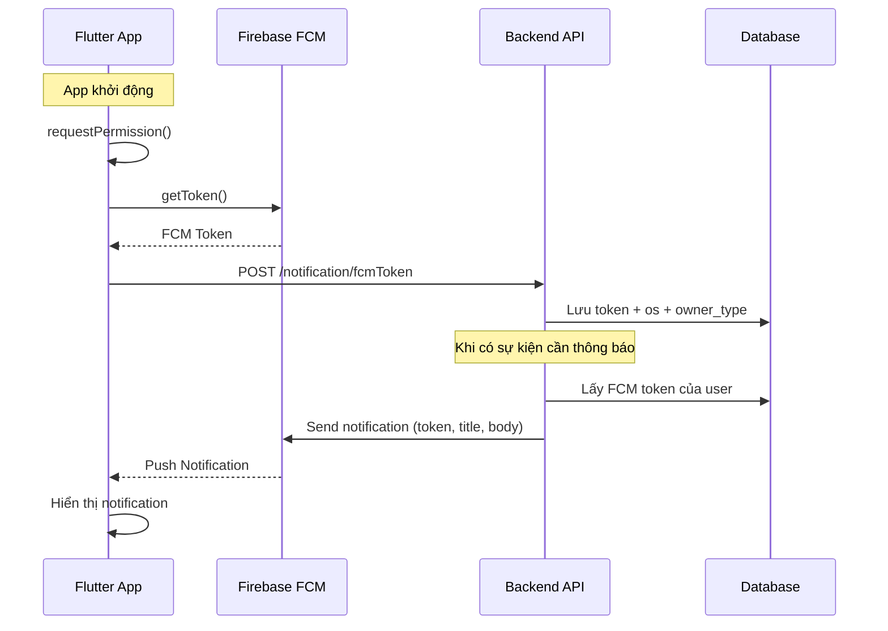

# FCM Push Notification - AnHolding CRM

## Tổng quan

Push Notification sử dụng **Firebase Cloud Messaging (FCM)** để gửi thông báo đến thiết bị người dùng. Frontend nhận và hiển thị notification, đồng thời đăng ký FCM token với backend để server có thể gửi notification targeted.

---

## Architecture Flow



---

## Cấu trúc File

```
lib/
├── main.dart                          # FCM init + gửi token lên backend
├── src/core/
│   ├── services/
│   │   └── firebase_messaging_service.dart  # Service xử lý FCM
│   └── paths/
│       └── api_paths.dart             # Endpoint: /notification/fcmToken
└── injection_container.dart           # DI registration
```

---

## Flow Chi Tiết

### 1. App Khởi Động (`main.dart`)

```
main() → runApp() → _initFcm()
```

- `_initFcm()` chạy **sau** `runApp()` để không block UI
- Gọi `FirebaseMessagingService.initialize()` với 2 callback:
  - `onTokenReceived` → gửi token lên backend
  - `onMessageTapped` → xử lý navigation khi user tap notification

### 2. FCM Service (`firebase_messaging_service.dart`)

`initialize()` thực hiện 7 bước:

| Bước | Hành động | Mục đích |
|------|-----------|----------|
| 1 | `requestPermission()` | Xin quyền notification từ user |
| 2 | `getToken()` | Lấy FCM token (unique cho mỗi device) |
| 3 | `onTokenRefresh.listen()` | Lắng nghe khi token thay đổi |
| 4 | `_setupLocalNotifications()` | Config local notification cho foreground |
| 5 | `onMessage.listen()` | Xử lý message khi app ở foreground |
| 6 | `onMessageOpenedApp.listen()` | Xử lý tap notification từ background |
| 7 | `getInitialMessage()` | Xử lý tap notification từ terminated |

### 3. Gửi Token lên Backend (`_sendFcmTokenToBackend`)

```dart
POST /notification/fcmToken
Content-Type: form-data

{
  "token": "dWx2a0RBbkRf...",    // FCM Token
  "os": "android",                // "ios" | "android"
  "owner_type": "user"            // "user" | "customer"
}
```

Token được gửi tự động khi:
- App khởi động lần đầu
- Token bị refresh (Firebase tự refresh định kỳ)

### 4. Hiển thị Notification

| Trạng thái App | Xử lý bởi | Hiển thị |
|----------------|------------|----------|
| **Foreground** | `onMessage` → `_showLocalNotification()` | Local notification popup |
| **Background** | FCM SDK tự xử lý | System notification tray |
| **Terminated** | FCM SDK tự xử lý | System notification tray |

---

## Backend Handler (Top-level Function)

```dart
@pragma('vm:entry-point')
Future<void> firebaseMessagingBackgroundHandler(RemoteMessage message) async {
  log('FCM background message: ${message.messageId}');
}
```

> ⚠️ **Bắt buộc** phải là top-level function (không nằm trong class). Firebase yêu cầu điều này để chạy trong isolate riêng khi app bị terminated.

---

## Cấu Hình Platform

### Android
- `google-services.json` → `android/app/`
- `build.gradle.kts`: `isCoreLibraryDesugaringEnabled = true` + `desugar_jdk_libs`
- Không cần cấu hình thêm

### iOS (cần Apple Developer Program $99/năm)
- `GoogleService-Info.plist` → `ios/Runner/`
- Xcode: **Push Notifications** capability
- Xcode: **Background Modes** → Remote notifications
- Upload **APNs Key** (.p8) lên Firebase Console
- `AppDelegate.swift`: `registerForRemoteNotifications()`

---

## Dependencies

```yaml
firebase_messaging: ^15.2.4
flutter_local_notifications: ^18.0.1
```

---

## Test Push Notification

1. Chạy app → copy **FCM Token** từ Debug Console
2. Firebase Console → **Messaging** → **Create campaign**
3. Điền title + body → **Send test message** → paste token → **Test**

---

## Troubleshooting

| Lỗi | Nguyên nhân | Fix |
|------|-------------|-----|
| `apns-token-not-set` | iOS Simulator không hỗ trợ APNs | Test trên Android hoặc iOS device thật |
| `app delegate swizzling` | iOS config issue | Chạy trên Android emulator |
| FCM token = null | Chưa có permission hoặc chạy trên simulator | Kiểm tra permission + dùng device thật |
| 404 khi gửi token | Backend chưa có endpoint | Kiểm tra API URL trong `.env` |

---

## TODO (Chưa hoàn thành)

- [ ] Implement `onMessageTapped` → navigation đến màn hình cụ thể dựa trên `message.data`
- [ ] Gửi token kèm theo khi user login (ngoài lúc app khởi động)
- [ ] Xoá/deactivate token khi user logout
- [ ] Subscription theo topic cho broadcast notification
- [ ] iOS: hoàn tất cấu hình khi có Apple Developer Program
